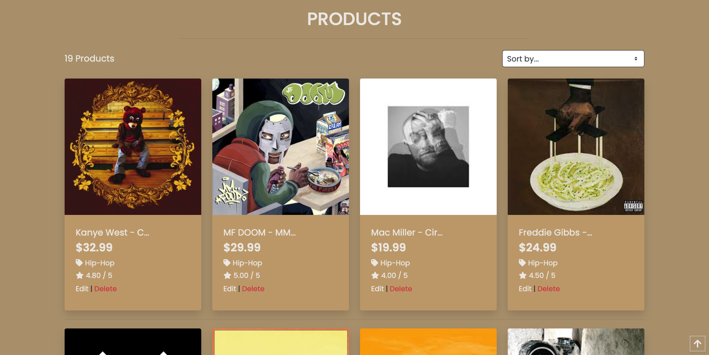

# **Bunker Vinyl - Record Store** 

<a href="https://bunker-vinyl-ms4.herokuapp.com/"></img></a>## **<ins>Project_Motivation</ins>**
With this project my aim was to demonstrate my knowledge of Django by developing an e-commerece store.
I decided on a site selling vinyl records and other music products products and named it bunker vinyl after my favourite record store.

## **<ins>UX</ins>**

### <ins>User_Stories</ins>

**Customer;**

As a customer I want to;
1. view records from genres that I might be interested in buying
2. navigate the site with ease, view products by categories, search for items I am looking for.
3. view details of the products that I am interested in.
4. see reviews of products from other customers, leave my own review
5. add products to my cart as I browse the site and see a running total of the cost.
6. review the contents of my cart with ability to adjust quantities or remove items before I check out.
7. have a secure checkout, that ensures my credit card details are safe.
8. have the ability to create an account and save my details for return visits
9. confirmation of my order once placed and details emailed to me as a record

**Site Owner;**

As the owner I want to;
1. provide a site that is inviting to customers, easy to use and intuitive to navigate
2. provide customers with a method to leave reviews on products and view reviews from other customers
2. allow customers to checkout without needing to register but include the option to register and save details if they wish to.
3. add new products to the site
4. be able to edit or remove existing products as required
5. ensure the site is secure, limit actions based on login profiles (add / edit / delete products | write / edit / delete review)
6. provide a secure method for payment processing to protect customer payment details and site reputation

### <ins>Wireframes</ins>
During the planning stage of the project, wireframes were drawn up for each of the pages of the site.
The wireframes, (linked below) were used as guides during the development with some minor tweaks during the build process
to improve the site.

| Title | Link to Wireframe |
| --- | --- |
| Wireframes | <a href="https://www.figma.com/file/FCGBW9bj0w9Qc8yto9Z0dw/Untitled?node-id=0%3A1" target="_blank">Bunker Vinyl Wirerames</a>|

[Index](#Index)
- - - -

## **<ins>Features</ins>**
The site consists of 5 individual apps within the main Django framework. 
- Profile

    Contains the profile page that allows an authenticated customer to save their delivery details and view a list of past orders

    

Profile Page

        
    

     

- Home

    Home app, conatins the main home (index.html) page with a message and button inviting the customer to start shopping the site.
    
    

Home Page

        
    

     

- Products

    The producs app contains all the producs, filter options (filter by genre or type ) and sort options.
    The site consists of two html pages, 
        
    1. All Products page, displays all products in the DB.
    Products are displayed in a bootstrap card. The image for each product is a link to open the details for the selected product.

    

Products Page

        
    

     

    2. Detail page, that provides all products details to the customer. 

    The details page also provides the interface to select the quantity and add the product to the cart.

    

Details Page

        
    

     

- Shopping Bag
    The shopping cart page provides the customer with a summary of their items before they move to the checkout screen. While in the cart, the customer can adjust the quantity of any product or remove the product entirely. Once updates are process the customer will see the updated cart totals and shipping cost for their cart before moving to check out. 
   
    

Shopping Bag Page

        
    

     

- Checkout
    The checkout screen consists of three major elements;
    1. Delivery Details
    
    A table for the customer to provide their shipping address and contact details. 
    For a login / registered user this data can be pulled from their profile app.
    Includes option to save delivery details as default delivery in profile

    2. Payment card details

    The payment details form, integrated to Stripe where the customer can securely enter their card details. Card details are sent to stripe for processing and never saved on the site for security reasons.

    3. Summary of the order

    The checkout page also provides a summary of the order that is being process, the customer can see all the details of what there order consists of and the cost of each product and total cart cost.

    

Checkout Page

        
    

     

    **Order Successful**
    Once the order has been successfully processed the customer is taken to the order successful page. The order number for the placed order is provided, a summary of the order and confirmation that an e-mail with the details have been sent.
    
    

Checkout Success Page

        
    

     

### <ins>Existing_Features</ins>
Based on the user stories, the following features are included in this deployment of the site

**User;**
- View all products
- view products by categories
- customer reviews - view all reviews by product. Add your own review, edit & delete your reviews
- add contents to cart, review and adjust cart directly from cart page
- secure checkout, using stripe payments
- account creation. save default deliver information, view past orders
- e-mail confirmation of order

**Admin**

- a complete e-commerce site, with intuitive navigation and understanding for customers
- secure customer payment system via Stripe linked to my account.
- DBs for products, orders and users.
- form to add a new product to the DB.
- options from products details page to edit product details or delete the product from the DB.

## <ins>Technologies_Used</ins>

**Github** https://github.com/
- Github is the repository used for version control & storage of the project.
- Github pages was used for the deployment of the site.

**Gitpod** https://www.gitpod.io/
- Gitpod was the IDE used for the development throughout the project.

**Heroku** https://id.heroku.com/login
- Heroku cloud used for hosting the live application

**Amazon Web Services** https://aws.amazon.com
- Used to host static files and media images for the site

**Google Fonts** https://fonts.google.com/
- Google fonts provided fonts for the project (Roboto Condensed & Serrat)

**Bootstrap** https://getbootstrap.com/
- CSS Framework

**Font Awesome** https://fontawesome.com/
- Icons used through the web site are sourced from Font Awesome

**Django** https://www.djangoproject.com/
- Open source web framework.

**Python3** https://www.python.org/
- Backend programming language, use in Django

**jQuery** https://jquery.com/
- jQuery Javascript for additional functionality on the site

**SQLite** https://www.sqlite.org/index.html
- SQLite DB (integrated in Django) use as the DB in development environment

**PostgreSQL** https://www.postgresql.org/
- PostgreSQL DB (integrated in Heroku) use as the DB in production environment

**Stripe** https://stripe.com
- For payment processing

**w3schools** https://www.w3schools.com
- For additional code explanations & features to use.

[Index](#Index)
- - - -
